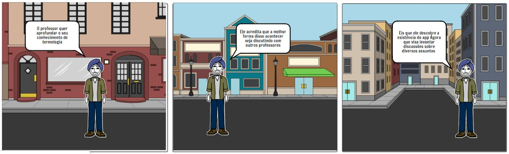
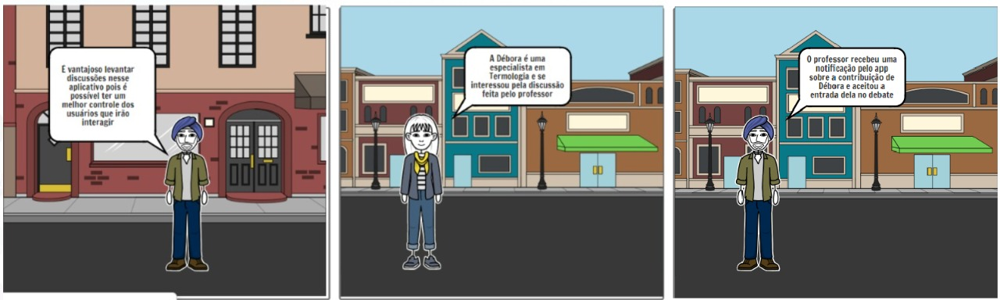
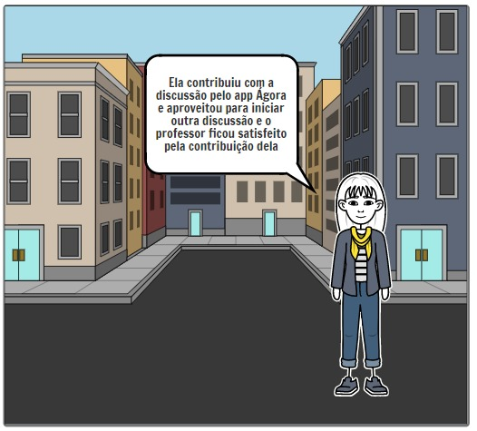
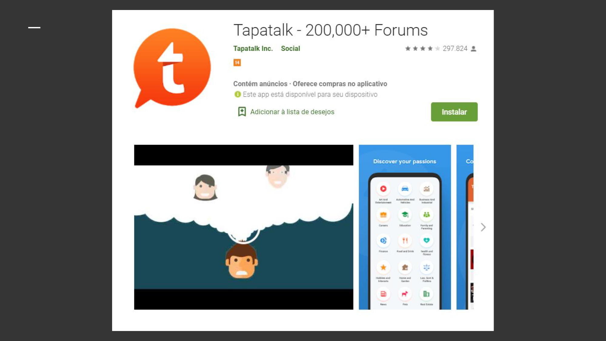
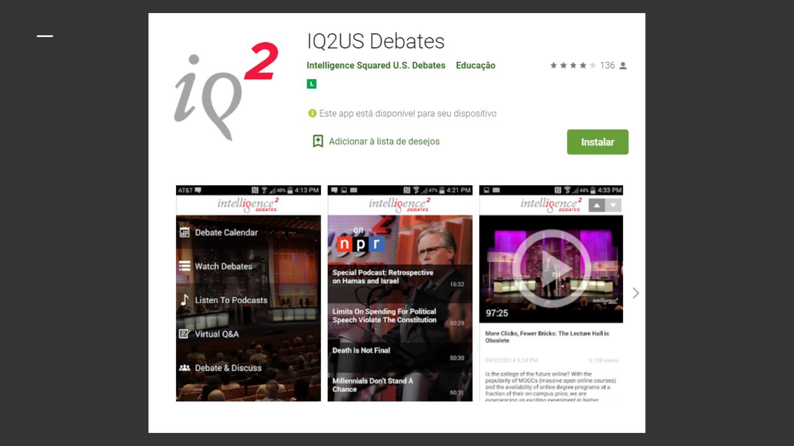
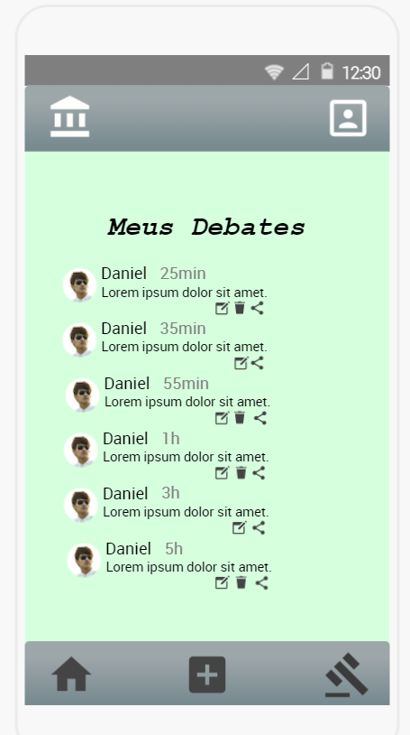

# AgoraApp
O Agora App é o aplicativo que têm como objetivo fomentar discussões e debates.

Com o modo Agora, o usuário abre um debate e recebe diversas opiniões e informações que o enriqueçam de forma a expandir e aumentar o conhecimento sobre aquele assunto.

Já com o modo Confronto, ele se coloca diante de opiniões diversas sobre o seu assunto com pessoas que concordem ou não com aquilo que foi escrito. Tendo como objetivo mudar perspectivas e dar uma nova visão sobre qualquer tema.

## Storyboard 

O Storyboard visa mostrar um cenário de utilização do app, na cena um professor que necessita aprofundar seu conhecimento sobre um tema e pra isso precisa de mais opiniões. Ele então encontra o Agora App com o seu modo Agora. 

## Aplicações Correlatas

Existem algumas aplicações com funcionalidades similares as do Agora APP. 

### TapaTalk : +10 Milhões de Downloads 

### IQ2US Debates : +10.000 de Downloads

## Mapa Conceitual

O mapa conceitual do Agora, visa mostrar o escopo do nosso projeto, é a segunda etapa pré-protótipos.
  

## Protótipo de Baixa Fidelidade

O Protótipo de Baixa Fidelidade representa uma primeira prototipagem do nosso APP, nesse caso procuramos expor visualmente as funcionalidades sem nenhuma interação nem fluxo de navegação. Foi muito importante pois nos permitiu ter uma noção exata de como o aplicativo iria ser moldado.

## Protótipo de Alta Fidelidade

O Protótipo de Alta Fidelidade representa as telas do APP, dessa vez já ocorre um fluxo de navegação e de fato é a imagem do nosso APP final. Para a construção da interface nos apoiamos no material do Material Design que oferece uma série de padrões de desenvolvimento de telas.

### Login

### Cadastro

### Interesses

### Home

### Criar Debate

### Modo Agora

### Modo Confronto

### Meus debates

## Desenvolvido por:

Lázaro Queiroz da Silva

João Victor Fontes

Victor Pereira

